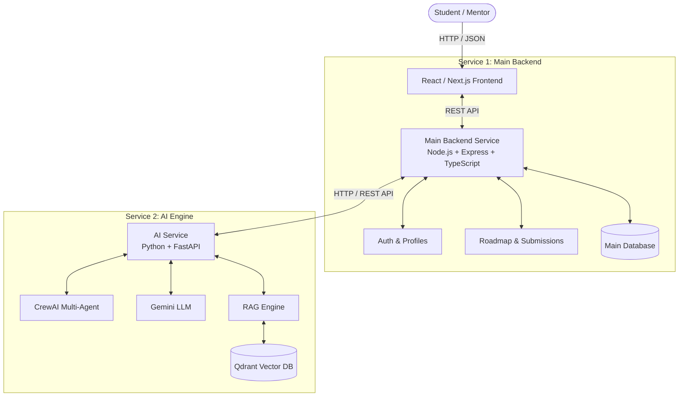
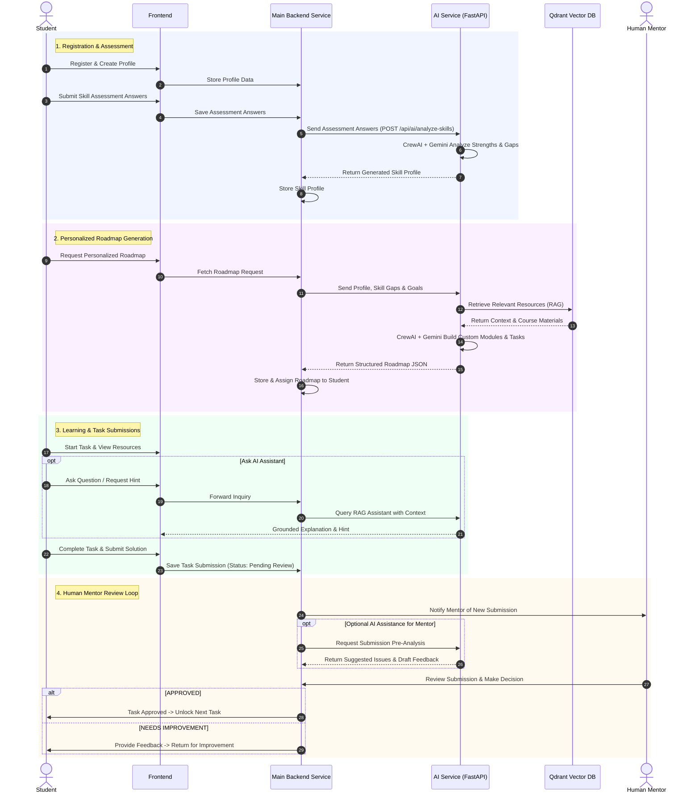

# 🎓 AI-Powered Personalized Learning Platform
## Technical Architecture & System Flow Document

> **Executive Summary:** An adaptive, two-service microservices architecture that uses CrewAI, Gemini LLM, RAG, and a Qdrant vector database to generate personalized skill profiles and learning roadmaps for students, backed by real human mentor review loops.

---

## 1. Microservices Architecture & Responsibilities

The system consists of **ONLY TWO MICROSERVICES**:

| Service Name | Primary Tech Stack | Key Responsibilities & Capabilities |
| :--- | :--- | :--- |
| **1. Main Backend Service** | Node.js, TypeScript, Express | • Student Authentication (Signup / Login) • Student Profile Management (Education, Goals, Existing Skills) • Assessment & Question Storage • Roadmap & Task Progress Tracking • Task Submission Management • Human Mentor Dashboard & Feedback Routing • Orchestrating REST API calls to the AI Service |
| **2. AI Service** | Python, FastAPI, CrewAI, Gemini LLM, RAG, Qdrant | • AI Skill Analysis (CrewAI multi-agent processing) • Skill Profile Generation (Strengths, Weaknesses, Gaps) • RAG Resource Retrieval (Qdrant Vector DB) • Personalized Learning Roadmap Generation (Modules & Tasks) • AI Learning Assistant for Students • AI Assistance & Draft Feedback Generation for Human Mentors |

---

## 2. High-Level System Architecture

---

## 3. Complete Student Learning Flow

---

## 4. Detailed Project Flow

### Step 1: Student Registration & Profile Creation
- Student registers via the Frontend.
- **Main Backend** handles authentication and stores student background (education, career goals, existing programming/tech experience).

### Step 2: Assessment
- Student completes an adaptive assessment (Programming, DSA, AI/ML, Web/Backend, Databases).
- **Main Backend** stores raw responses and forwards them to the **AI Service**.

### Step 3: AI Skill Analysis
- **AI Service** processes answers using **CrewAI** multi-agent analysis.
- Evaluates skill levels, identifies knowledge gaps, and creates a tailored **Skill Profile**.
- Results are returned to the **Main Backend** for permanent storage.

### Step 4: Personalized Roadmap Generation
- Student requests a customized learning path.
- **Main Backend** passes the student's profile, skill profile, and career goals to the **AI Service**.
- **AI Service** executes **RAG queries** against **Qdrant** to find relevant learning materials.
- **CrewAI + Gemini** construct a structured, step-by-step roadmap broken down into manageable modules and tasks.
- **Main Backend** saves the roadmap and presents it to the student.

### Step 5: Learning & Task Execution
- Student works through assigned roadmap tasks.
- Student can ask the **AI Learning Assistant** for instant hints, code explanations, or resources (grounded by **RAG**).
- Student submits task deliverables through the **Main Backend**.

### Step 6: Human Mentor Review
- **Important:** The mentor is a **HUMAN expert**, NOT an automated AI decision-maker.
- The **AI Service** may optionally pre-analyze submissions to assist mentors by highlighting potential issues or drafting feedback suggestions.
- The **Human Mentor** makes the final decision: **Approve** or **Request Improvement**.

### Step 7: Progress Loop
- **If Approved:** Task marked complete $\rightarrow$ Student advances to the next task.
- **If Needs Improvement:** Mentor feedback delivered to Student $\rightarrow$ Student improves work $\rightarrow$ Resubmits to Human Mentor.

---

## 5. Core Technology Roles Explained

### 🤖 CrewAI Multi-Agent System
- Operates within the **AI Service**.
- Orchestrates multiple specialized agents (e.g., *Skill Evaluator Agent*, *Curriculum Architect Agent*) to analyze assessment data and construct balanced, high-quality learning roadmaps without human manual planning.

### 📚 RAG (Retrieval-Augmented Generation) + Qdrant Vector DB
- **Qdrant** stores high-dimensional embeddings of curated learning materials, tutorials, and documentation.
- **RAG** retrieves accurate, grounded context before passing prompts to **Gemini LLM**, preventing hallucinations and providing precise learning hints.

### 👨‍🏫 Human Mentor (Human-in-the-Loop)
- Maintains quality control over student learning.
- AI provides speed and insights; the **HUMAN mentor** provides true validation, final grades, and personal guidance.

### 🔌 Main Backend ↔ AI Service Communication
- Communicates asynchronously via clean **REST API HTTP JSON requests**.
- Keeps business logic, user management, and DB transactions in Node.js while keeping AI computation isolated in Python FastAPI.
